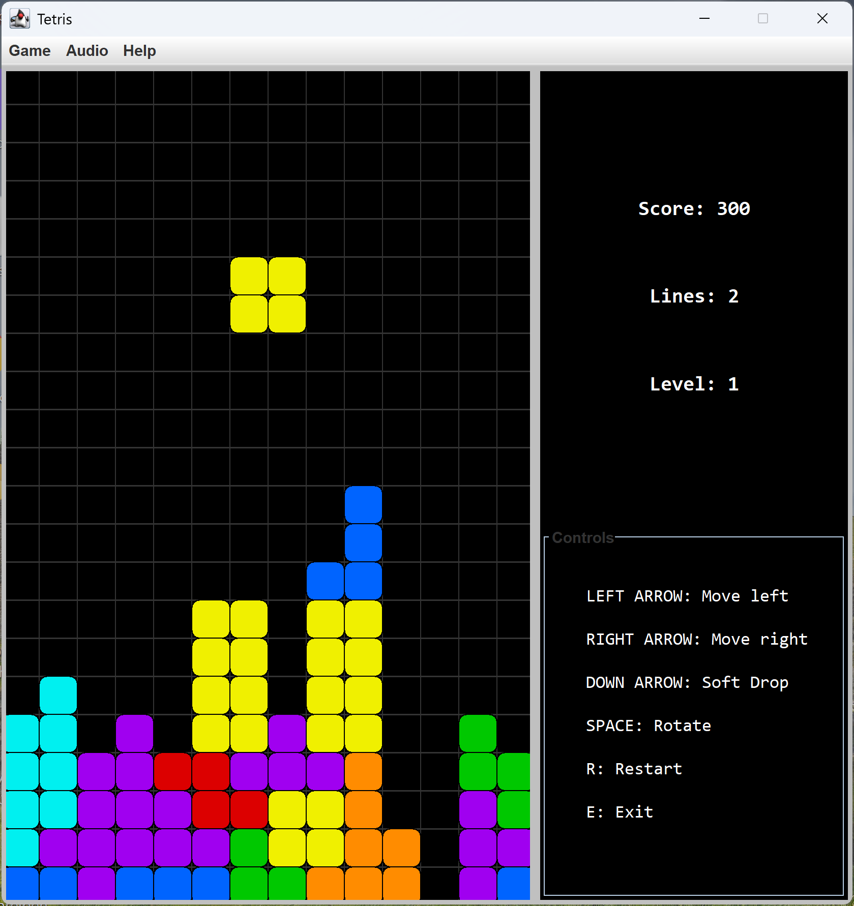
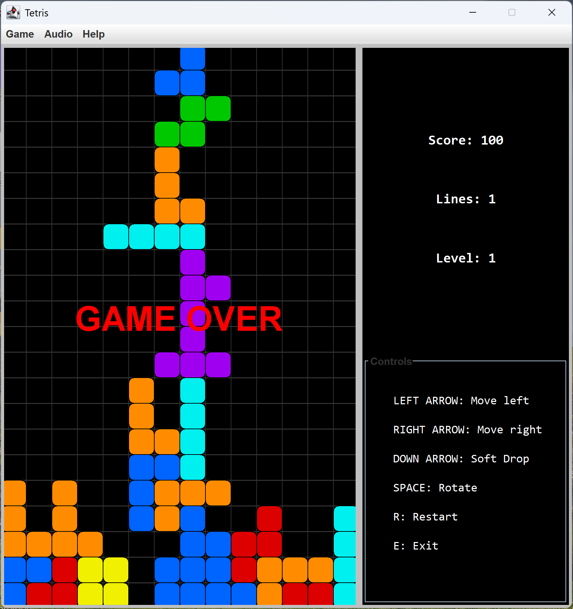

# 🎮 Tetris Teks Version

## 📌 Overview

This project is my own implementation of the Tetris Game in pure Java using the Swing and the AWT packages.

### 🎯 Purpose

The main goals of this project are:

* Improve my **Java programming skills**
* Practice **object-oriented design**
* Learn how to build a **complete, interactive application**
* Demonstrate my ability to work on a **real-world Java project**

---

### Important! 

This project is ***my first project and aims to apply my theoretical Java knowledge in practice***. 
Therefore, some bugs, such as (The Pause Button in this case), can occur, but I'm working on them to make the project more stable.

## 🕹️ How to Play

Control the falling tetromino blocks and place them strategically to complete horizontal lines and get points.

### 🎮 Controls

```
LEFT ARROW : Move left
RIGHT ARROW: Move right  
DOWN ARROW : Soft drop  
SPACE KEY  : Rotate   
P   : Pause/Resume  
R   : Restart
E   : Exit
```

---

## 🧠 Scoring System

You earn points by clearing lines:

| Lines Cleared | Points      |
| ------------- | ----------- |
| 1 line        | 100 × level |
| 2 lines       | 300 × level |
| 3 lines       | 500 × level |
| 4 lines       | 800 × level |

👉 Try to **clear as many lines as possible at once** to maximize your score!

### 📈 Level System

* Every 10 lines → level increases
* Higher levels → faster falling speed
* Higher levels → more points

---

## ▶️ How to Run

### 🔧 Requirements

* Java JDK 8 or higher

### 🚀 Steps

1. Open the Terminal.

2. Clone the repository:

```bash
git clone https://github.com/your-username/tetris-java.git
```

3. Navigate into the project:

```bash
cd tetris-java
```

4. Compile the project:

```bash
javac Main.java
```

5. Run the game:

```bash
java Main
```

---

## 🖼️ Gameplay Preview
<p align="center">
  
  
</p>

---

## 🛠️ Features

* ✅ Classic Tetris gameplay
* ✅ Score and level system
* ✅ Pause / Resume functionality
* ✅ Restart system
* ✅ Clean User Interface (UI) with dashboard (HUD)

---

## 📚 What I Learned

* Java Swing UI development
* Game loop and timing logic
* Event handling (keyboard input)
* Object-oriented design (Tetromino system)
* State management (start, pause, game over)

---

## 🚀 Future Improvements

* Next piece preview
* Sound effects
* Better animations
* High score system
* Add a start window

---

## 👨‍💻 Author

* Ariel Tekam
* GitHub: https://github.com/ArielTekam-maker

---

## ⭐ If you like this project

Feel free to ⭐ the repository and share feedback!
